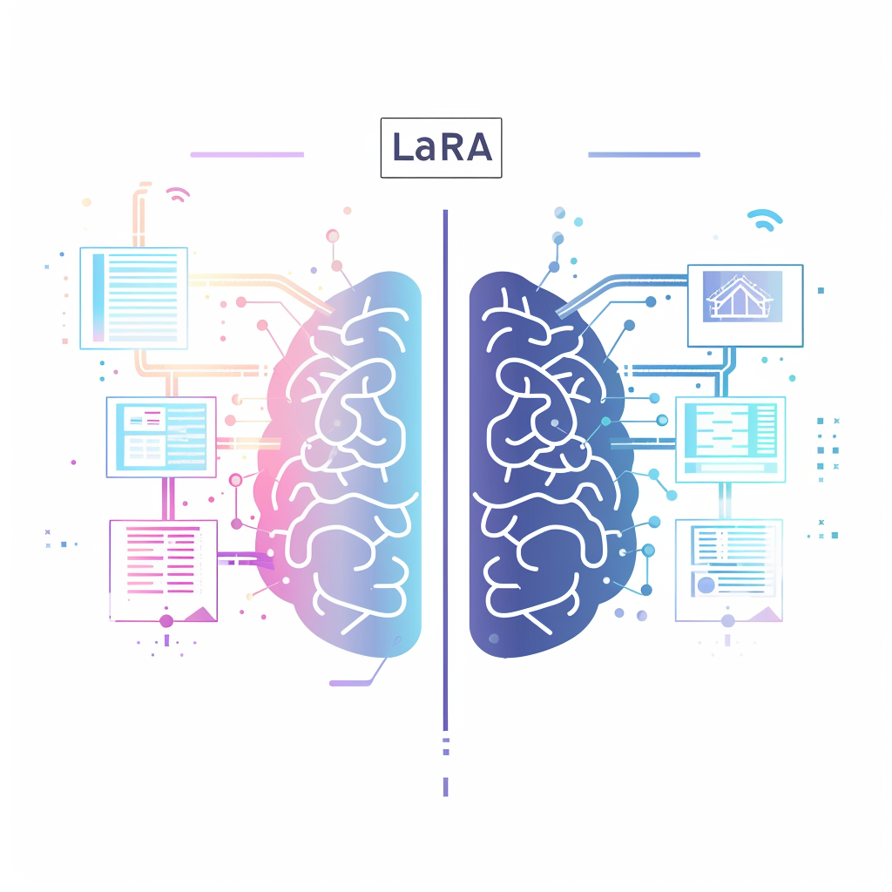
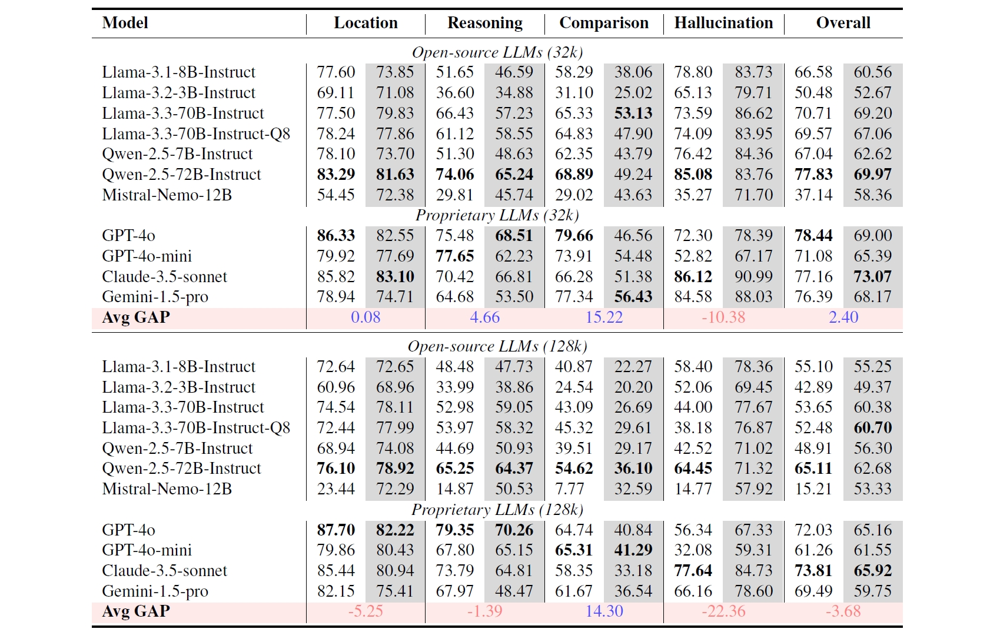

<div align="center"><h1>&nbsp; LaRA: Benchmarking Retrieval-Augmented Generation and Long-Context LLMs</h1></div>

<p align="center">
<font size=5>📑</font>
<a target="_self" href="https://arxiv.org/abs/2502.09977"> </a> 
<font size=6>•</font> 
<font size=5>💻</font> 
<a target="_self" href="https://github.com/Alibaba-NLP/LaRA"> </a>


## 🔎Introduction

With the rapid advancement of Large Language Models (LLMs), the definition of "long context" has undergone significant transformation as input length limitations have expanded from the initial 4K tokens to the now commonly supported 128K or even million-token inputs. Retrieval-Augmented Generation (RAG) once served as a critical solution for processing extremely long texts by retrieving text fragments relevant to the query to accommodate input length restrictions. However, as model context windows have dramatically expanded and long-text processing capabilities have made qualitative leaps, a challenging question emerges: In the current landscape where LLMs possess such powerful long-text understanding abilities, is RAG still an essential approach for handling long contexts?

To address this question, we introduce LaRA, a benchmark specifically designed to compare Long-context LLMs (LC LLMs) and RAG. LaRA encompasses both 32K and 128K context lengths, three types of naturally occurring long texts, and four context-based QA tasks that reflect real-world scenarios, totaling 2326 test cases. Our experimental results demonstrate that there is no definitive conclusion regarding the superiority of RAG versus LC LLMs, as performance is influenced by multiple factors including context length, context type, the model's ability to process long contexts, and task type. We hope our work can serve as a guidebook for designing effective routing systems between RAG and long-context LLMs.


> Main Experimental Results of 7 Open-Source and 4 Proprietary LLMs on LaRA,with the gray background representing <span style="background-color: rgba(128, 128, 128, 0.3); font-weight: bold;">RAG</span> and the white background representing LC. The highest-performing open-source and proprietary LLMs for each task are highlighted in bold. "Avg GAP" refers to the difference between the average accuracy of LC and RAG across all models for a specific task (calculated as LC minus RAG). Blue text indicates that LC performs better, while red text indicates that RAG is better.
> 

## 🔨Installation
### Step 1. Create a conda environment:
```shell
conda create --name lara python=3.10 -y
conda activate lara
```
### Step 2. Clone the repository and install the dependencies:
```shell
git clone https://github.com/Alibaba-NLP/LaRA.git
cd LaRA
pip install -r requirements.txt
```

## 📃Dataset
The 32k and 128k contexts and queries are stored in the `dataset` folder. The query files follow the naming convention `{context length}_{context type}_{task type}.jsonl`. The folder structure is shown below:
```
LaRA
├── dataset
│   ├── 32k
│   ├── 128k
│   └── query
│         ├──32k_book_comp.jsonl
│         ├──32k_book_hallu.json
│         ├──32k_book_location.jsonl
│         ├──32k_book_reasoning.jsonl
│         ├──32k_financial_comp.jsonl
│         ├──32k_financial_hallu.jsonl
│         ...
...
```
*If you wish to generate more data, you can refer to our file `query_gen.py` which demonstrates how we generate QA pairs based on financial statements.*

## 📈Evaluation
### Generate predictions

We provide evaluation code for both open-source models and proprietary models in the `evaluation` folder:
* `evaluation/eval_full.py`
* `evaluation/eval_rag.py`
* `evaluation/eval_full_open.py`
* `evaluation/eval_full_open.py`

For proprietary LLMs, please fill in your own API key to call the model. We provide functions for Qwen and GPT models.
```python
api_key = "YOUR_API_KEY"
org_id = "THE_ORG_ID"
```
If you want to get the prediction of a specific model under certain context lengths, context types, and task types, you can run:
```shell
python eval_full.py --query_type location --context_type paper --context_length 32k --eval_model qwen2.5-7b-instruct
```
Or run the script for comprehensive evaluation:
```shell
cd scripts
bash run_eval.sh
```
Model predictions will be stored in `evaluation/prediction`, where we have already provided our run results. 

### Compute score
After obtaining predictions, you can directly use the script below to evaluate using GPT-4o or Qwen-max (you'll also need to enter your API key in `./evaluation/compute_score_llm.py`)
```shell
cd scripts
bash compute_score.sh
```
The statistics of evaluation results can be found in `./evaluation/prediction/result`.
## 🌻Acknowledgement
We implement our code with reference to [InfiniteBench](https://github.com/OpenBMB/InfiniteBench), and we greatly appreciate their promising work.

## 🔔Citation
```bibtex
@article{li2025lara,
  title={LaRA: Benchmarking Retrieval-Augmented Generation and Long-Context LLMs-No Silver Bullet for LC or RAG Routing},
  author={Li, Kuan and Zhang, Liwen and Jiang, Yong and Xie, Pengjun and Huang, Fei and Wang, Shuai and Cheng, Minhao},
  journal={arXiv preprint arXiv:2502.09977},
  year={2025}
}
```